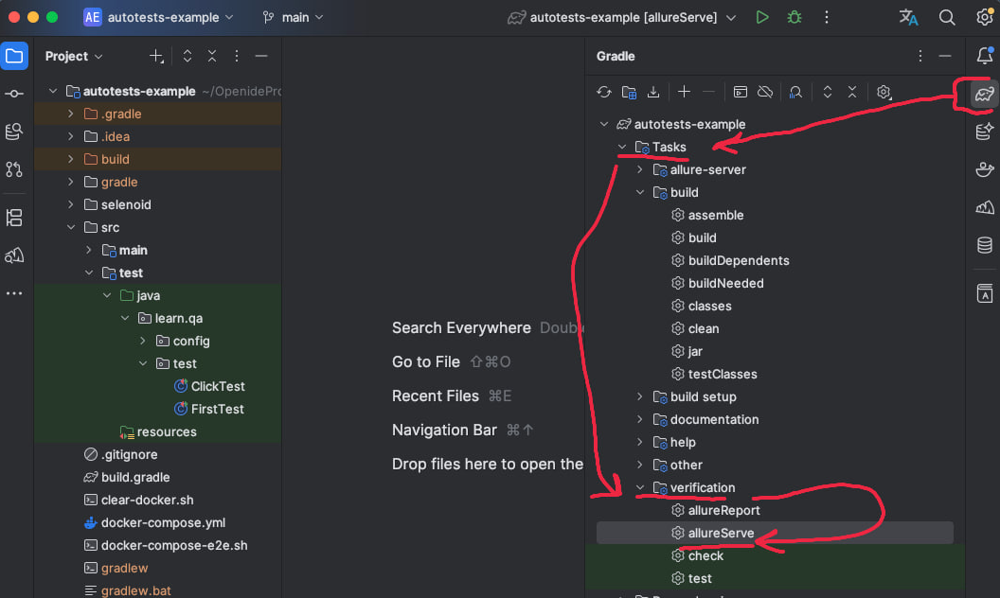

## **Технологии**
- [Docker](https://www.docker.com/resources/what-container/)
- [Docker-compose](https://docs.docker.com/compose/)
- [JUnit 5](https://junit.org/junit5/docs/current/user-guide/)
- [Allure](https://docs.qameta.io/allure/)
- [Selenide](https://selenide.org/)
- [Selenoid & Selenoid-UI](https://aerokube.com/selenoid/latest/)
- [Allure-serve](https://github.com/kochetkov-ma/allure-server)
- [Gradle 8.14](https://docs.gradle.org/8.14/release-notes.html)
- [Java 17](https://docs.aws.amazon.com/corretto/latest/corretto-17-ug/patches.html)

# Минимальные предусловия для запуска тестов

#### 1. Установить Java версии 17.
Версию установленной Java необходимо проверить командой `java -version`

# Возможные вопросы
#### А где находятся тесты?
src/test/java/learn/qa/test

#### Как посмотреть отчёт теста в Allure?


#### Как почистить отчёты?
Скрин выше
Tasks/build/clean

# Пример UI теста
```java
// Все зависимости которые используются в тесте тут
import static com.codeborne.selenide.Condition.attribute;
import static com.codeborne.selenide.Selenide.$;

import com.codeborne.selenide.Configuration;
import com.codeborne.selenide.Selenide;
import com.codeborne.selenide.logevents.SelenideLogger;
import io.qameta.allure.selenide.AllureSelenide;
import org.junit.jupiter.api.DisplayName;
import org.junit.jupiter.api.Test;
// Используются 
// Junit - запуск тестов
// Selenide - для Web тестов
// Allure - отчётность

// Папка: 'ClickTest'
// Для разбиения по папкам
@DisplayName("ClickTest")
public class ClickTest {

  @Test // Создаёт точку входа (main) для запуска теста в Junit
  @DisplayName("Selenide click button") // Название теста: 'Selenide click button' в папке: 'ClickTest'
  void clickButtonTest() {
    // Добавление всех selenide web действий в Allure отчёт
    SelenideLogger.addListener("Allure-selenide", new AllureSelenide()
        .savePageSource(false)
        .screenshots(false)
    );
    // Настройка браузера
    Configuration.browser = "chrome";
    Configuration.browserVersion = "145";
    // Сценарий
    
    // Стартует браузер: 'chrome v145' и открывает ссылку 'http://uitestingplayground.com'
    Selenide.open("http://uitestingplayground.com");
    // Локатор Css который ищет в DOM дереве по тегу 'a' и ссылке href с текстом ссылки '/click'.
    // Найдет элемент в DOM если он есть: <a href="/click">
    // Иначе упадёт с ошибкой: 'NoSuchElementException'
    $("a[href='/click']")
        // Человекочитаемое описание локатора, вместо '$("a[href='/click']")'
        .as("Главная страница. Кнопка клик")
        .click(); // клик по найденному элементу, если он не кликабелен / невидим то упадёт с ошибкой
    // Локатор Css который ищет в DOM дереве по тегу 'id' по полному совпадению 'badButton'
    // любой тег содержащий 'id="badButton"' 
    $("#badButton")
        .as("Станица Клик. Кнопка клик")
        .click();
    $("#badButton")
        .as("Атрибут класс кнопки клик")
        // В найденном элементе, ищет атрибут 'class' если найден то проверяем полное значения 'btn btn-success'
        // ищет
        // <* class="btn btn-primary" id="badButton>
        // * - условное обозначение для примера, так как тут не важно какой тег найдет, все что содержит валидный class и id
        // !!! если будет найдено несколько, то выберет первый
        .shouldHave(attribute("class", "btn btn-success"));
  }
}
```

# Docker (Опционально)

#### 1. Настройка

Докер нужен для запуска Allure serve и Selenoid + Selenoid UI

[Установка на Windows](https://docs.docker.com/desktop/install/windows-install/)

[Установка на Mac](https://docs.docker.com/desktop/install/mac-install/) (Для ARM и Intel разные пакеты)

[Установка на Linux](https://docs.docker.com/desktop/install/linux-install/)

После установки и запуска docker daemon необходимо убедиться в работе команд docker, например `docker -v`

#### 2. Запуск контейнеров
Команды можно запустить из документации

При условии - консоль в коневой директории проекта 'autotests-example'

**Mac**
```sh
  bash docker-compose-e2e.sh
```

Развернутые локально контейнеры будут доступны в браузере по ссылкам:
* [Allure serve](http://127.0.0.1:8081/)
* [Selenoid UI](http://127.0.0.1:9091/#/)

#### 4. Настройка отправки отчетов
в корне проекта файл: build.gradle
```groovy
allureServer {
    relativeResultDir = 'build/allure-results'
    allureServerUrl = 'http://127.0.0.1:8081'

    requestToGeneration = { uuid ->
        """{"reportSpec": {
                "path": [ "Amurskiy-A" ],
                "executorInfo": {
                    "buildName": "Amurskiy-A",
                    "buildUrl": "Amurskiy-A_autotests",
                    "reportName": "Amurskiy-A_autotests"
                }
            },
            "results": [ "$uuid" ],
            "deleteResults": true
        }"""
    }
}
```
allureServerUrl - ссылка по которой будет публиковать отчёт должна совпадать с [Allure serve](http://127.0.0.1:8081/)

Эти значения можно и нужно отредактировать под себя, рекомендую отказаться от пробелов в наименовании любых сущностей
* **path** - пусть по которому сохранится
* **название** - сборки отчёта buildName
* **reportName** - название отчёта

Пример тут заменил значения на текст **New_Text**
```groovy
requestToGeneration = { uuid ->
    """{"reportSpec": {
                "path": [ "New_Text" ],
                "executorInfo": {
                    "buildName": "New_Text",
                    "buildUrl": "New_Text",
                    "reportName": "New_Text"
                }
            },
            "results": [ "$uuid" ],
            "deleteResults": true
        }"""
}
```

#### 3. Удаление всех контейнеров
Удалит все контейнеры которые
Но не удалить images
**Mac**
```sh
  bash clear-docker.sh 
```
